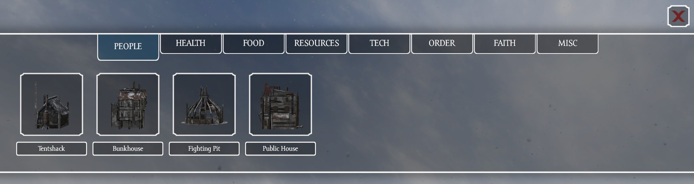

Buildings can be built by [Lawkeeper](../Factions/Lawkeepers.md) faction. Building menu can be by default opened with `N` key.

When you hover over a building, window will appear with a description and list of [resources](../Resources/Resources.md) and their amounts required for selected building. 

Once you select building to build, hologram of selected building will appear. By default it should be green indicating possibility to build selected building but if something is preventing its placement, hologram will turn red.

