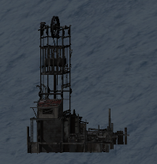

The Coal Mine provides infinite source of coal . It needs to powered by the [generator](generator.md). Once the [generator](generator.md) is running, machine operators can turn on the the Coal Mine on top of the ladder in the control room.

If the [generator](generator.md) is running, coal pile will appear on the back side of the of Coal Mine by the coal pile. This coal pile then needs to be mined.