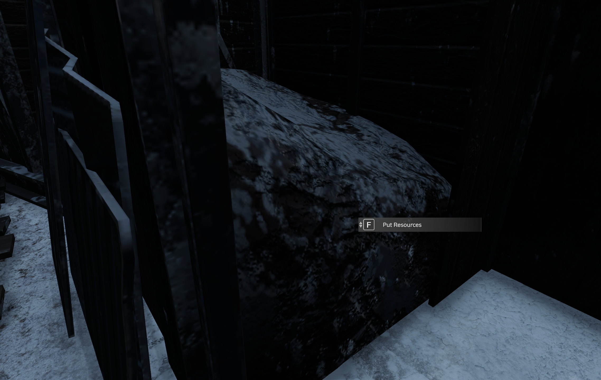
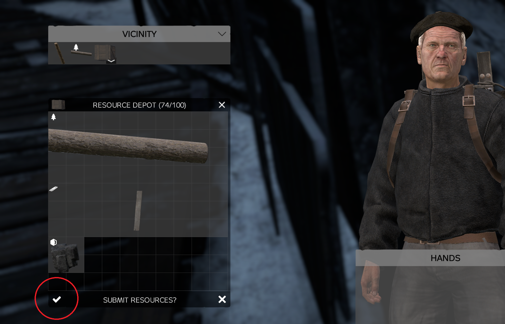

The Resource Depot is the place to store [resources](../Resources/Resources.md).

In order to deposit [resources](../Resources/Resources.md) player must walk up to the right spots and use the action to open the deposit window.

Player can then place [resources](../Resources/Resources.md) into the invenory of the depot and click the submit button. Once submitted, player receives reward in form of heat stamps.

Resources for building are automatically taken from Resource Depot located near the [generator](generator.md). The [generator](generator.md) also automatically takes coal from here while it is running.

