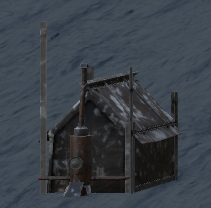
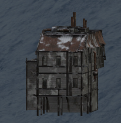
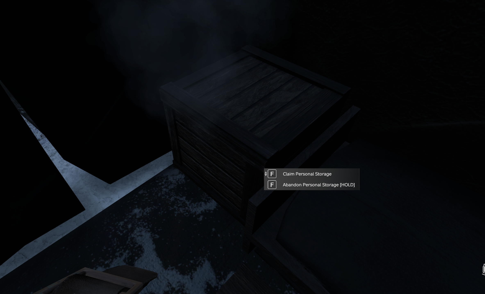
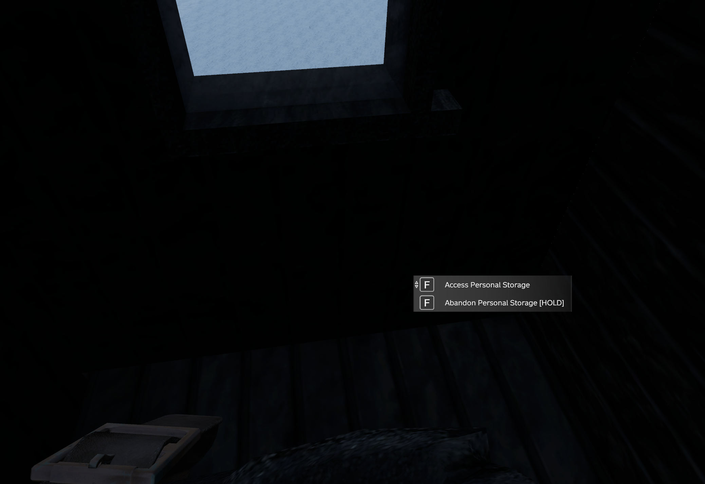

Both Tentshack and Bunkhouse are places to rest and store your personal belongings. There is limited amount of people who can claim said buildings as their home and use personal storage.

In order to get personal storage player must be granted permission from the [governing](../Factions/Voting.md) faction. Once permission is granted, player can walk up to the crate in the Tentshack or one of the rooms in the Bunkhouse and claim storage via the action. This provides options to access your storage or if not needed, abandon it.

#### Tentshack Upgrades

In order to unlock personal storage space for a limited number of players the Storage [upgrade](Upgrades.md) must be installed.

In addition to the storage a local heater can be installed as [upgrade](Upgrades.md). It offers a small amount of heat which directly drains coal from the resource depot if any available.
Matches are required to start the heater!