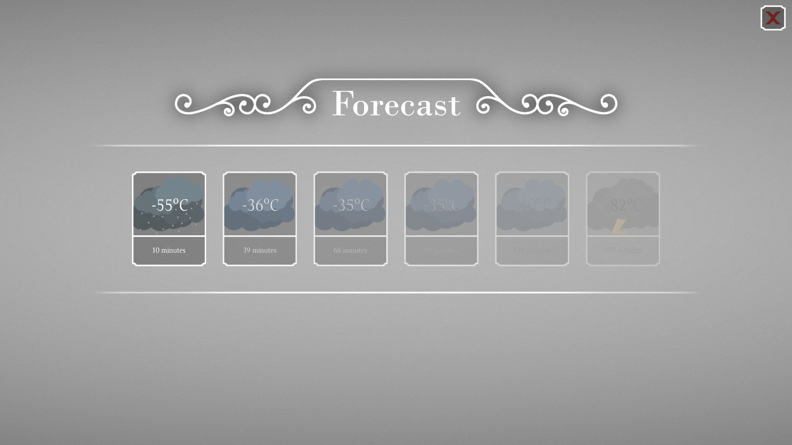

The Beacon is powered by the [generator](generator.md). If the [generator](generator.md) is not running, player is unable to use this building.

Once the [generator](generator.md) is running, player can raise the beacon. Once the beacon is raised to the maximum height, player with forecast skill can predict upcoming weather. The higher the skill, the longer the prediction.

