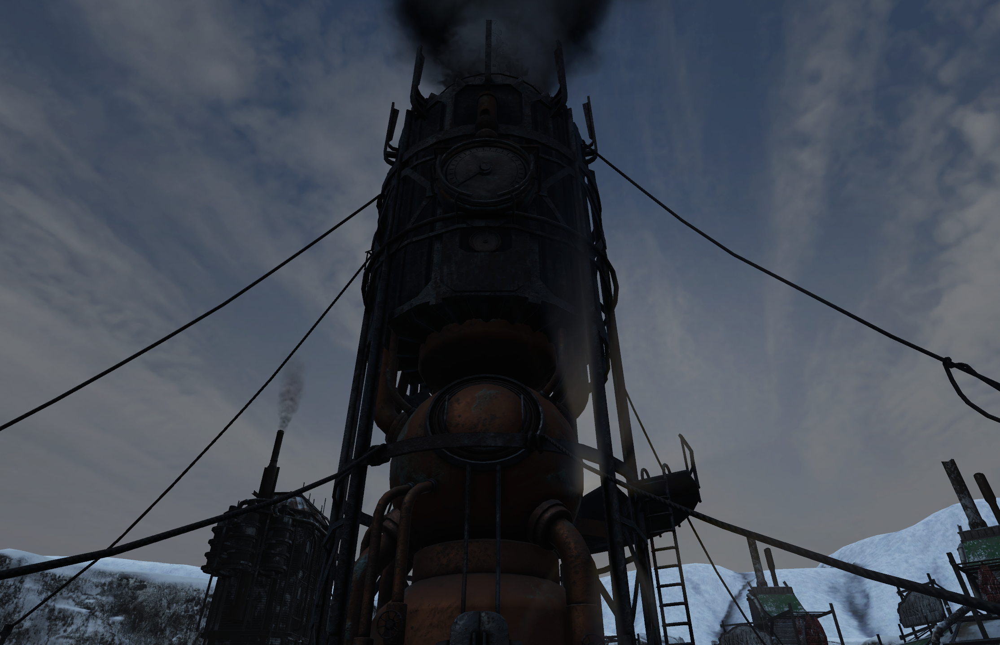

The Generator is very important building and without the Generator, there is no life in this world. It can power various buildings such as [Coal Mine](Coal Mine.md) or [Beacon](beacon.md). It can heat up most of the buildings. 

In order for the Generator to run it requires coal that is automatically taken from [Resource Depot](Resource Depot.md). The Generator can be turned on and off by the [governing](../Factions/Voting.md) faction. Once the Generator is not running, it will not provide heat or power to any of the buildings.
 Gages on its side provide indication of how much coal is left.

