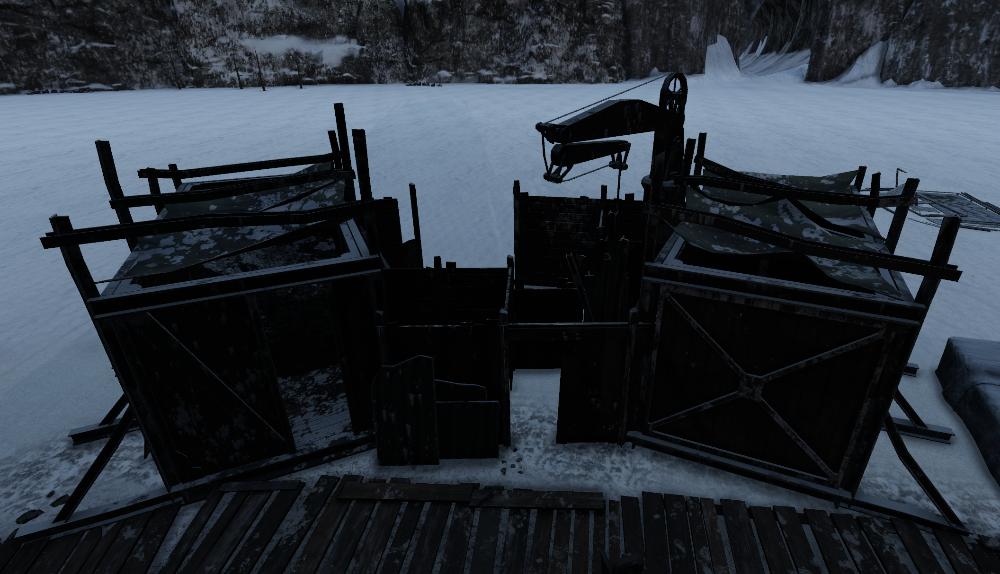
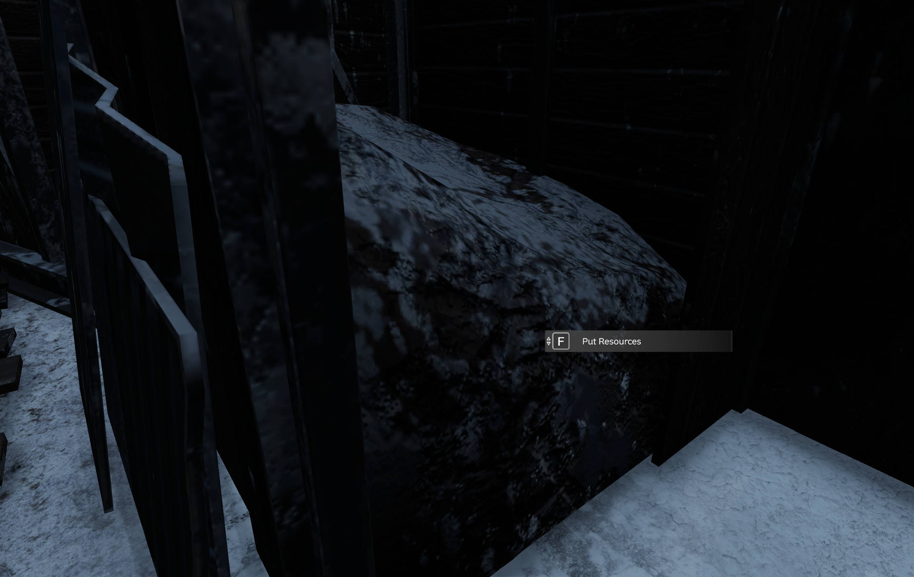
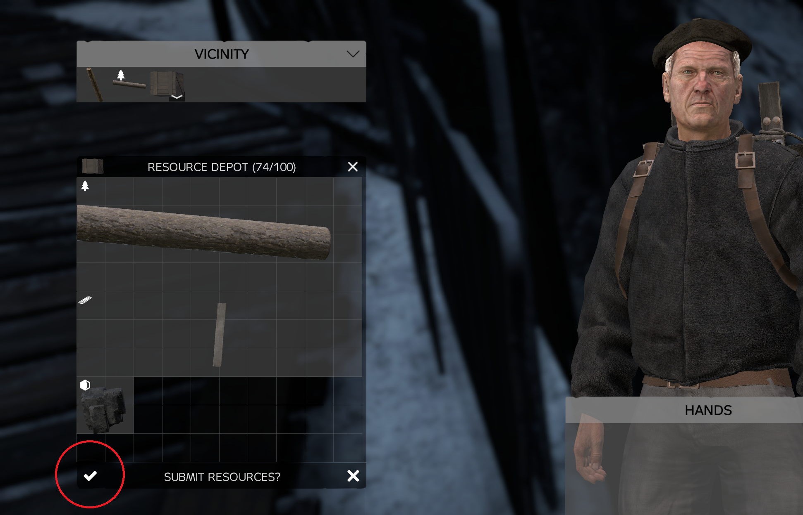

- The Resource Depot is the place to store raw materials.

- In order to deposit materials you must walk up to the right spots and use the action to open the deposit window

- Here you place raw materials (indicated with their unique resource icon) into the invenory of the depot and click the submit button.

