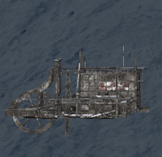

The Sawmill is used to turn wooden logs into planks. It needs to powered by the [generator](generator.md). Once the [generator](generator.md) is running, machine operators can place log inside the cabin and start processing the wooden log. Once the process starts, wooden log will go through the Sawmill and saw blade will cut it in half. This process also yields sawdust.

