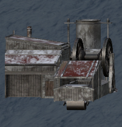

Steelworks is an infinite source of raw metal. Raw metal can be found on the pile near the entrance. Keep in mind that even though this is an infinite source of raw metal, it replenishes over time. Hence why you might not find raw metal at the pile at all times. 

This building can also process raw metal into ingots. For this process it needs to powered by the [generator](generator.md). Once the [generator](generator.md) is running, machine operators can turn on the the Steelworks. Once the Steelworks are running, player can process the raw metal into an ingot near the mold.

This building also has a workbench for processing ingots.