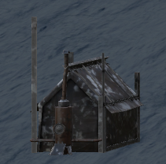
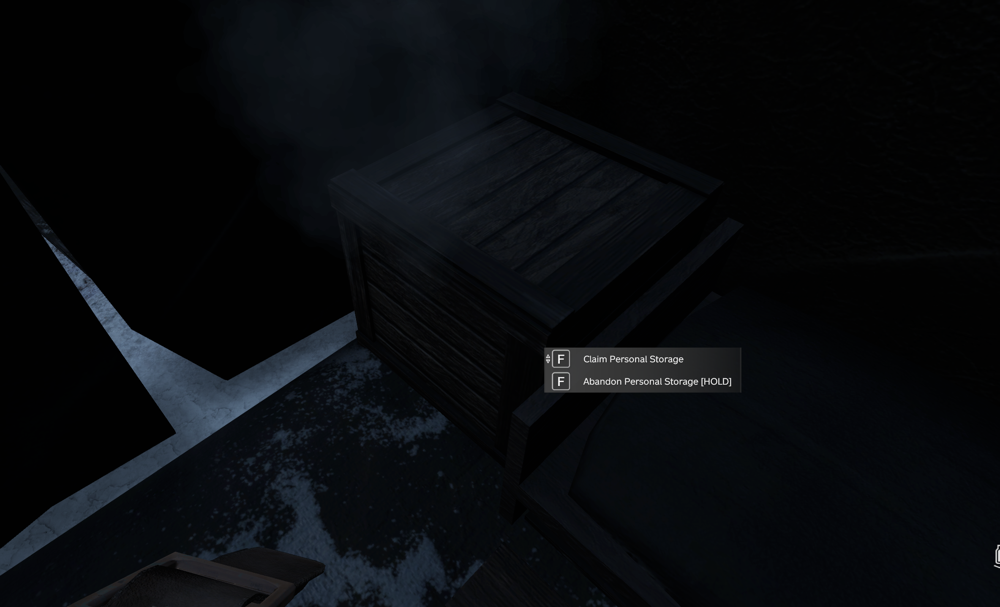
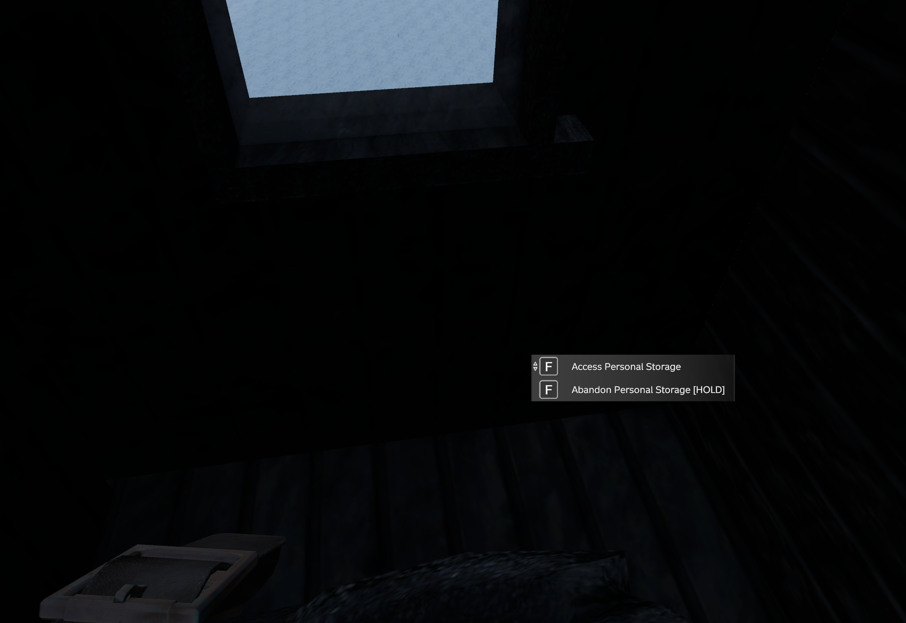

- The Tentshack and Bunkhouse is a place to rest and store your personal belongings.

- The Tentshack has storage room for X indiviuals and the bunkhouse has room for X individuals
- In order to get your personal storage you must walk up to the crate in the Tentshack or one of the rooms in the Bunkhouse and claim storage via the action.
- Then you have the options to access your storage or if not needed, abandon it.

