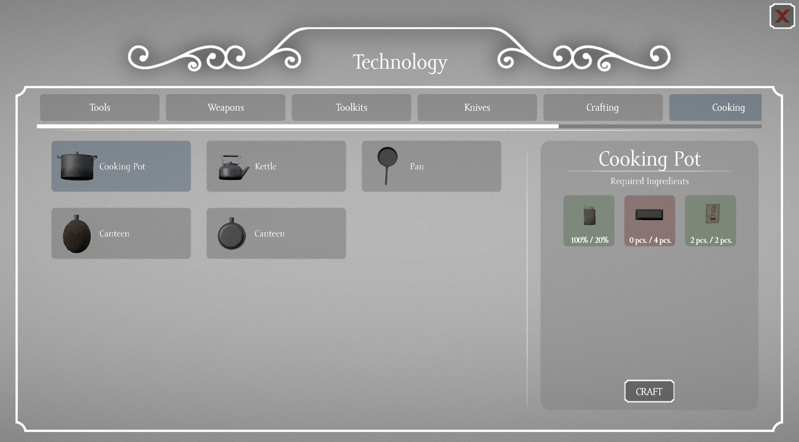

There are 2 types of crafting

- Crafting in hands
- Crafting in workbenches

## Crafting in hands
It is simple crafting that allows basic day to day stuff such as sharpening tools, refilling canteens or canisters, tearing up old clothes etc.

## Crafting in workbenches
Some of the buildings provide crafting stations called workbenches. These workbenches allow advanced crafting with multiple crafting ingredients. Usually recipes need to be unlocked with [skills](../Skills/Basics.md) and require some amount of [heat stamps](../Heatstamps.md). 
Workbenches by default have storage. During crafting, ingredients are taken not only from this storage but also from player's inventory. If workbench does not have any form of storage, igredients are taken only from player's inventory.

Once you select recipe in the crafting menu, you will see ingredients required for crafting. For each of the ingredients you can see on the right side of the `/` how many pieces or how much percentage (in case of items with percentage) of said ingredient is required. 
On the left side of the `/` you can see ingredients available in player's inventory and in the storage of workbench that is being used. Once player gathers all required resources, he is allowed to craft desired item.

If player clicks on recipe with middle mouse button, window with further description of the selected item will appear. This description is classic vanilla DayZ description showing weight, heat insulation or description of said item.