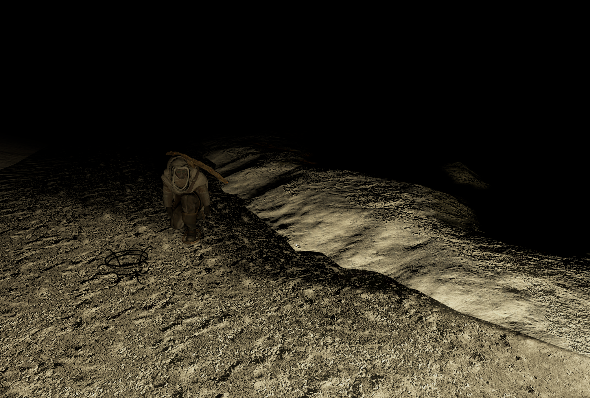

The Pilgrims, also known as Frostlanders, arise as outcasts and zealots of survival, embodying the belief that humanity must abandon cities, laws, and machines to endure the frozen world.
They are raiders, hermits, and mystics who have rejected the colony and its technology, choosing instead to live by instinct, hardship, and brutal self-reliance.
They are often glimpsed wrapped in frost-scarred garments and ritual markings, their presence marked more by fear than familiarity.

They roam the wasteland beyond the city’s reach, preying on expeditions and striking isolated outposts without warning.
To those who venture into the ice, they are whispered of as killers and thieves—figures who rob supplies, sabotage machinery, and leave survivors to freeze if it ensures their own survival.
In rare cases, expeditioners have managed to bribe them for safe passage to derelict ruins, or even trade supplies and information under tense, unspoken terms.
To the city at large, they remain living proof of what humanity becomes when order collapses.

Their philosophy is ruthless: only the strong deserve to live. They see the generator as a chain, technology as weakness, and community as an illusion that will shatter under true hardship.
This belief drives them to destroy what they cannot control and scavenge what they cannot replace, valuing survival above morality.
For the Pilgrims, justice does not exist—only endurance, instinct, and the cold judgment of the frost itself.

