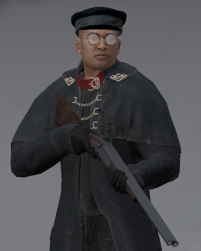
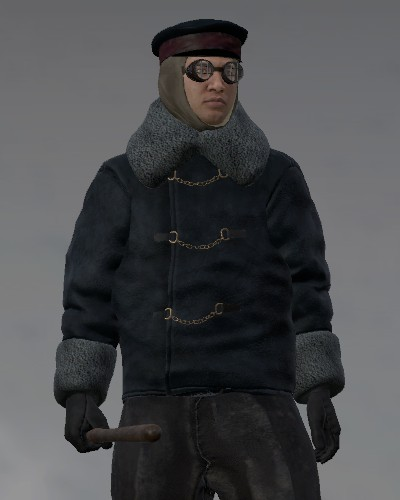
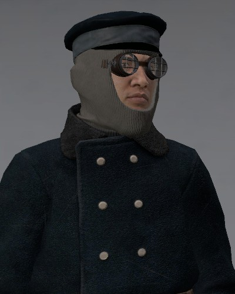

The Lawkeepers arise as enforcers of the order, embodying the belief that only strict discipline, absolute loyalty, and uncompromising justice can preserve humanity against the frozen wasteland. 
They are the guards or watchmen, who try to enforce the law in a city. Usually they can be seen wearing blue colored clothes distinguishing them from regular citizens. 

They patrol the streets trying to prevent chaos and crime from swallowing the fragile community.
To the starving, the sick, and the hopeless, they may appear as protectors. Yet to dissenters and rebels, they are feared as instruments of repression.

Their philosophy is simple: without law, there is no survival. They see mercy as weakness, and dissent as a threat greater than the frost itself. 
This conviction leads them to carry out harsh punishments for theft or disobedience and many citizens view this as brutal but necessary. For the Lawkeepers, justice is not about fairness, but about survival through unity and control.

