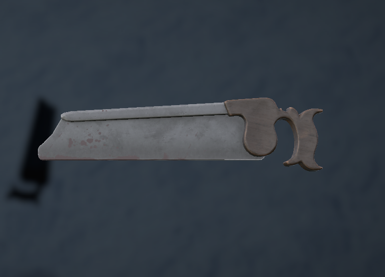
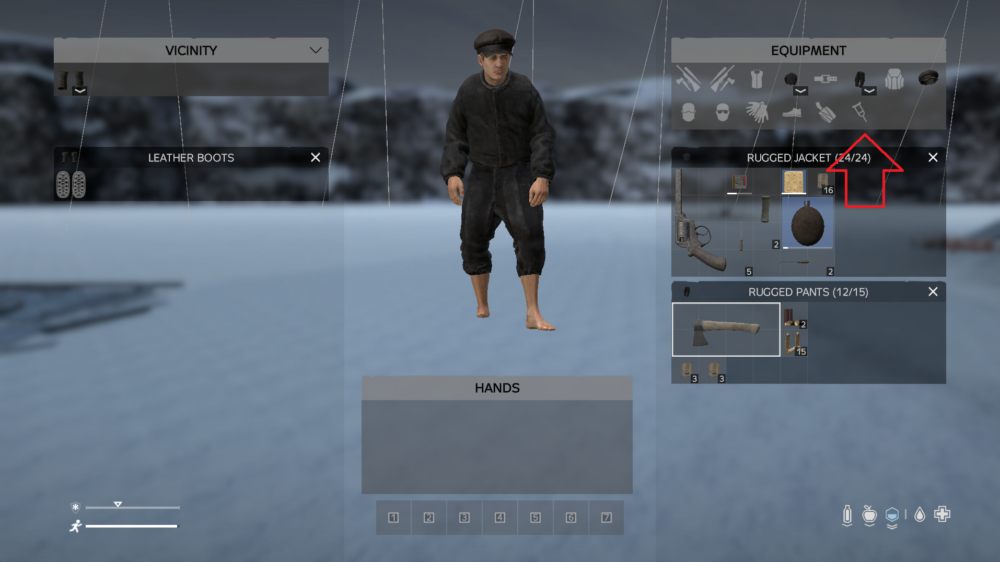
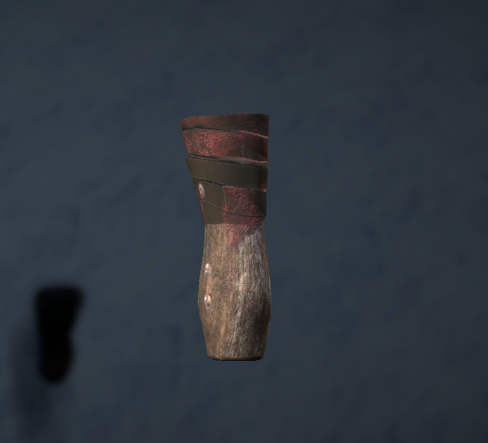

If frostbite progression has gone to far of the rails medicine wont save you anymore.
The day to day struggle with frostbite  will eventually be so unbearable that living with it is not an option anymore.

The only thing thats left to save the player will be an amputation.  
Amputation can be performed on the left and right foot depending on which one being affected.

In order for a player to undergo surgery the performing player needs the appropriate [skill](../Skills/Basics.md) and a bone saw.
The receiving player is advised to be put under heavy pain medicine or either be in a good and healthy state besides having frostbite.  

After receiving the amputation a new slot in the inventory of the player will be unlocked .
This slot will enable the player to put on foot/leg prosthetics helping to midigate the lost foot.
  

Prosthetics are available for left and right foot and can be crafted using the [workbench](../Crafting/Crafting.md) if according [skill](../Skills/Basics.md) has been unlocked.  
