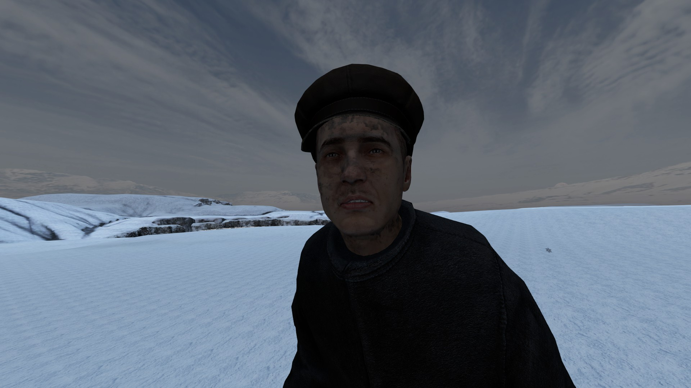

Living around the generater is anything else but a clean living space.
The generator running from coal constantly pushes ash in the air.
Over time the player will get dirty which will be indicated visually on the players face and hands.

Being dirty makes you vulnarable against other infections and diseases.
Make sure to wash yourself using a bottle of water.
In order to wash yourself put the bottle in your hands and take off all clothing.
A action to wash yourself will appear.
Washing will drain your heatbuffer.