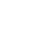

Frostbite is a negative progressive condition impacting the player either constantly or over time.
Frostbite consists of 4 stages complementing each other in negative effects on the player.

If the player started to get forstbite there is no need to worry.
As long as the progression is in stage 1  refilling the heat buffer and staying warm will be sufficient to treat the early stage.

Higher stages will need dedicated treatment while final stages can no longer be cured and [amputation](Amputation.md) is the only option that is left.