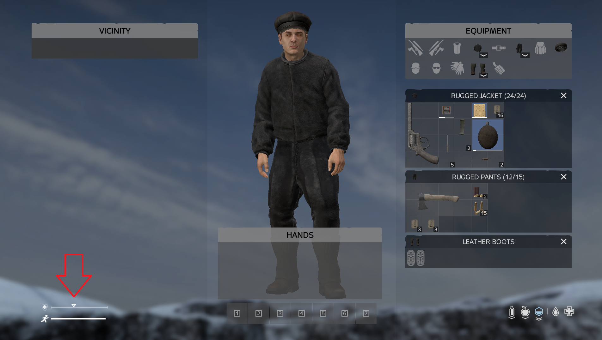

The vanilla heatbuffer/heatcomfort stat is replaced by a custom implementation.
The stats represents the core state around the positive or negative [temperature deficite](Heat Level.md).

The stat is represented by the following icon in the player stats hud: 

As long as this stat is not empty environmental temperate has no impact on the player. Therefore it is crucial for the player to keep the stat at a reasonable level and always pay attention to it. Once the heat buffer emptied out completely the player will start to get [frostbite](Frostbite.md)

The stat drops whenever there is a negative [temperature deficite](Heat Level.md).  
It raises when there is a positive [temperature deficite](Heat Level.md).

The speeed at which the heat buffer refills or empties out generally depends on the delta between the environmental temperature and the [temperature deficite](Heat Level.md).  
The loss of heat buffer can be slowed down by using clothing with good insulation values.  
A cold protection metere is placed in the bottom left corner of the inventory:
  
**Note: A full protection bar does not mean the player wont suffer loss of heat buffer it only indicates that the maximum protection level has been achieved**

If the heatbuffer emptied out and the protection against the cold is not high enough the player may slowely freeze to death.
Freezing to death is indicated by the following status badge indicator: 
Freezing to death can only be countered by refilling the heatbuffer stat.