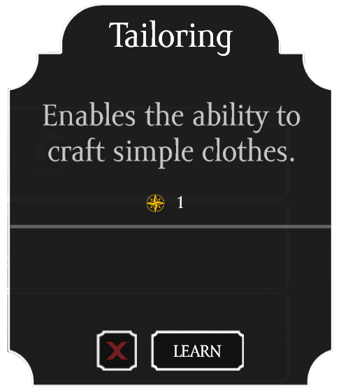

There are 3 types of skills

- [Food & Health](Food & Health.md) 
- [Technology](Technology.md) 
- [Hunting & Exploration](Hunting & Exploration.md) 

In order to unlock skills you need skill points. Each of the skill types has different skill points indicated by icons in the skill menu. Menu can be by default opened with `K` key (it can be changed in settings). Skill points are acquired by doing things that are connected to said skill trees. For example healing people gives experience to the [Food & Health](Food & Health.md) skill tree, hunting and venturing out into the wilderness give experience to [Hunting & Exploration](Hunting & Exploration.md) etc. Keep in mind that there is many more ways to get experience other than listed examples.

There are 5 tiers of skills in each of the skill trees. You need at least half of the skills in previous tier to unlock the next tier. To see description of the skill you need to click on a skill that you can learn. This description also shows how many skill points certain skill needs and button that allows you to unlock this particular skill.

Skills by default unlock new abilities, recipes or improve actions such as speed of the action, yield of resources etc.

