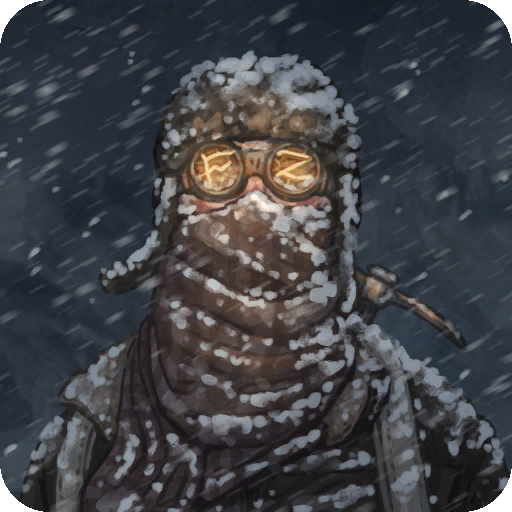

There are 3 types of skills

- Food & Health
- Technology
- Hunting & Exploration

In order to unlock skills you need skill points. Each of the skill types has different skill points indicated by icons in the skill menu

- Food & Health 
- Technology 
- Hunting & Exploration 